```{=html}
<script>
document.addEventListener('DOMContentLoaded', function() {
  var logo = document.querySelector('.slide-logo');
  if (logo) {
    var link = document.createElement('a');
    link.href = 'https://www.insileco.io';
    link.target = '_blank';
    logo.parentNode.insertBefore(link, logo);
    link.appendChild(logo);
  }
});
</script>
```

## Plan

- Cumulative effects assessments
- Completed assessments
- Operationalizing assessments 
- Perspectives
- About us
- Q&A


# Cumulative effects assessments

## An ecosystem perspective

::: {style="font-size: 80%;"}
####### ***Cumulative effects***: combined impacts of a project interacting with past, present, and future activities

<br>

####### ***Regional assessment***: evaluates how multiple activities interact with ecosystems at a regional scale to understand broader patterns of impact {.fragment}

<br>

####### ***Ecosystem management***: managing human activities based on ecosystem processes, using adaptive decisions to sustain structure, function, and resilience {.fragment}

::: 

:::footer
Loi canadienne sur l'évaluation environnementale (1992); Christensen et al. (1996); Sinclair et al. (2017)
:::


## funnel {#funnel_eco .full-image-slide data-background-image="img/funnel_eco.png" data-background-size="contain" data-background-position="center center" data-background-color="white"}

## Approach

<center>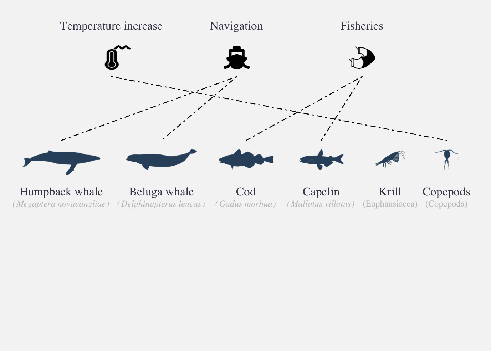</img></center>

:::footer
Halpern et al. 2008; Halpern et al. 2015; Halpern et al. 2019; Halpern et al. 2025
:::

## Approach

<center>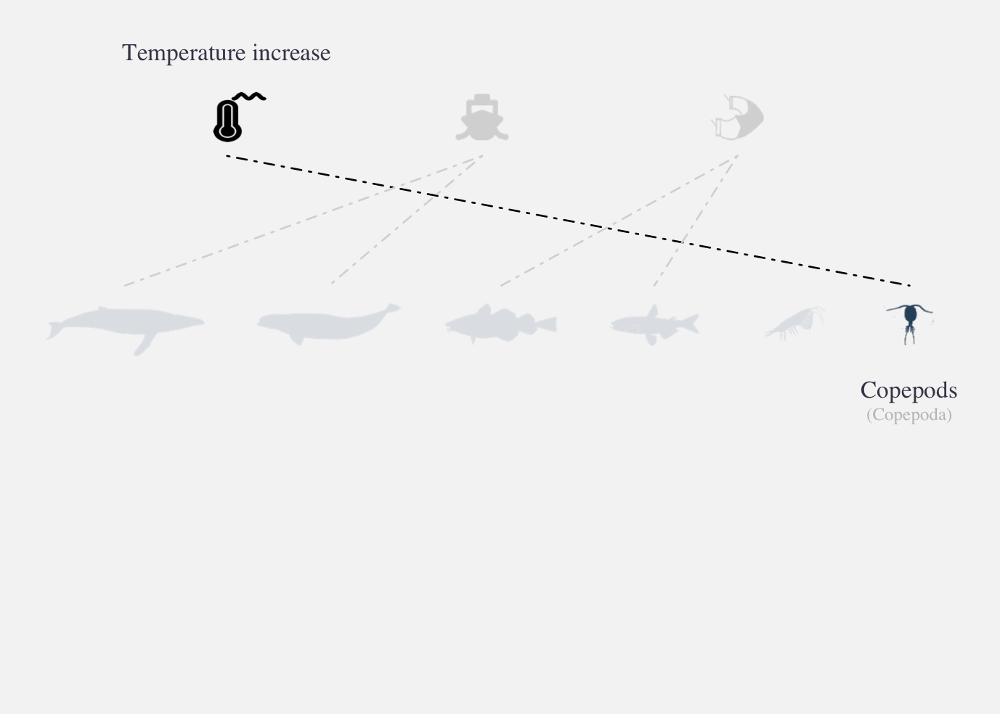</img></center>


:::footer
Halpern et al. 2008; Halpern et al. 2015; Halpern et al. 2019; Halpern et al. 2025
:::


## Approach

<br/><br/>

<center>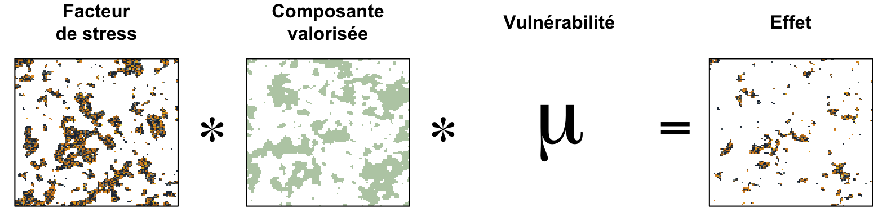</img></center>

<p style="font-size:90%;">
$$Effect = E_i * D_j * \mu_{i,j}$$
</p>

:::footer
Halpern et al. 2008; Halpern et al. 2015; Halpern et al. 2019; Halpern et al. 2025
:::

## Approach

<center>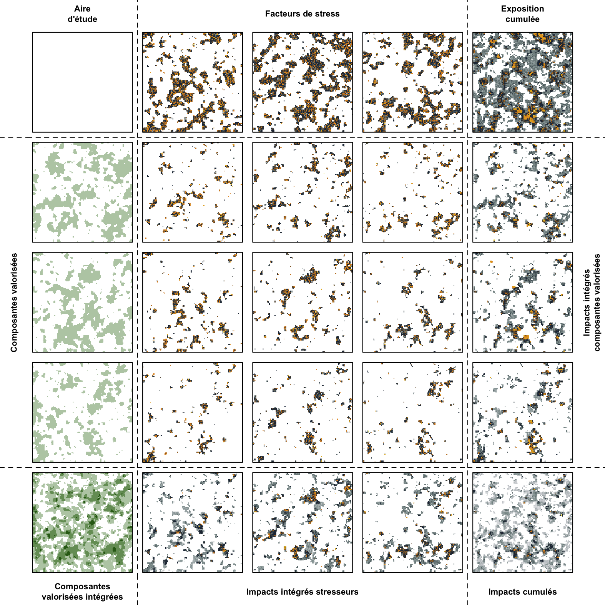</img></center>

:::footer
Halpern et al. 2008; Halpern et al. 2015; Halpern et al. 2019; Halpern et al. 2025
:::

## Approach

<center>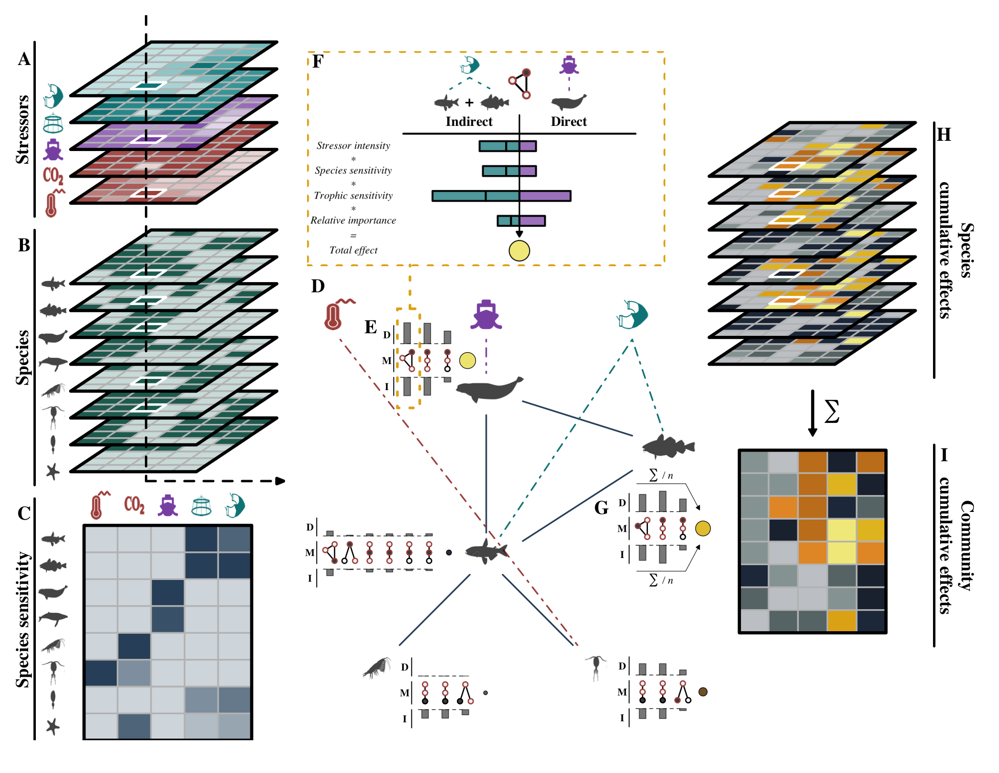</img></center>

:::footer
Beauchesne et al. 2025
:::


# Completed assessments

## NCEA {#useful-output .full-image-slide data-background-image="img/ncea.png" data-background-size="contain" data-background-position="center center" data-background-color="white"}

##

::: {.columns}
::: {.column}
::: {.callout-note icon="false"}
### St. Lawrence food webs

::: {style="font-size: 70%;"}
***Species***: 193 &emsp; ***Stressors***: 18

<a href="https://www.science.org/doi/10.1126/sciadv.adp9315" target="_blank" rel="noopener noreferrer">
<center>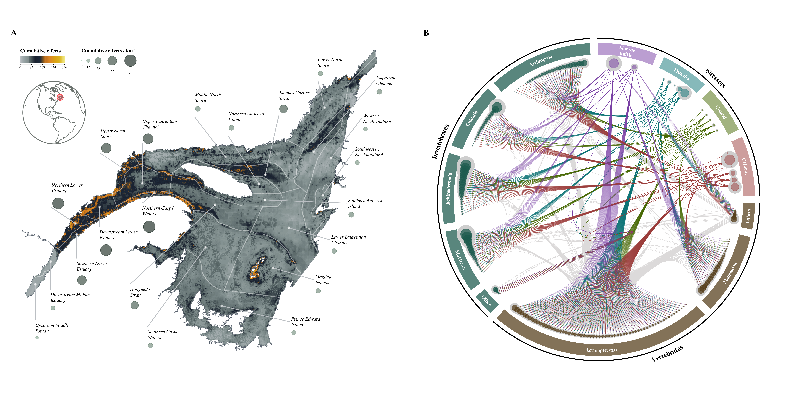</img></center>
</a>

:::

:::
::: {.callout-important icon="false" .fragment}
### Scotian Shelf food webs

::: {style="font-size: 70%;"}
***Species***: 205 &emsp; ***Habitats***: 21 &emsp; ***Stressors***: 16

<a href="https://ecosystem-assessments.github.io/nceadfo/" target="_blank" rel="noopener noreferrer">
  <center>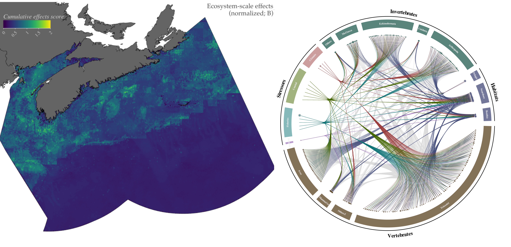</img></center>
</a>

:::

:::
:::
::: {.column}
::: {.callout-tip icon="false" .fragment}
### St. Lawrence maritime activities

::: {style="font-size: 70%;"}
***Valued components***: 4 (83) &emsp; ***Stressors***: 7 (26)

<a href="https://github.com/EffetsCumulatifsNavigation" target="_blank" rel="noopener noreferrer">
<center>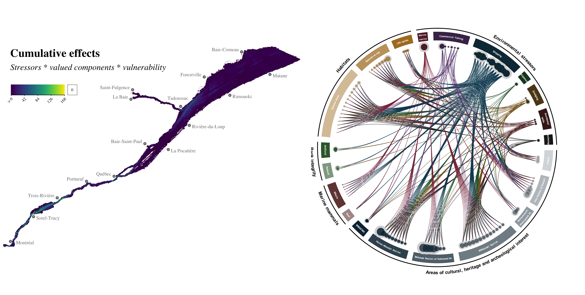</img></center>
</a>

:::
:::
::: {.callout-warning icon="false" .fragment}
### St. Lawrence Regional Assessment

::: {style="font-size: 70%;"}
***Upcoming***

<a href="img/ersl_regions.png" target="_blank" rel="noopener noreferrer">
<center>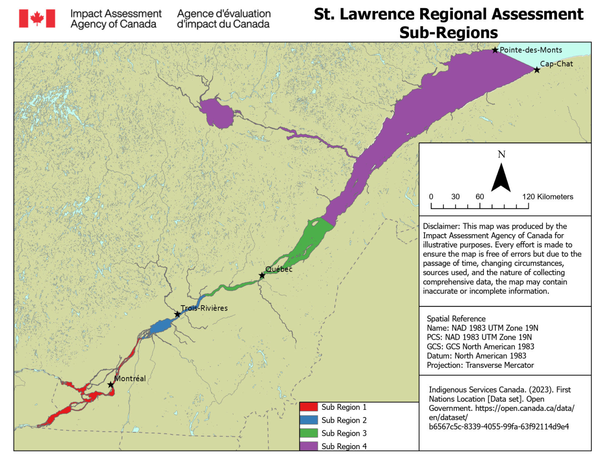</img></center>
</a>

:::
:::

:::
:::
<!-- end columns -->

## What questions are answered? {.transition-slide .center}

### *The current state of the region*

### *Risks to valued components* {.fragment}

### *Pathways of effects* {.fragment}

### *Management & mitigation priorities* {.fragment}


## Then what? {.transition-slide .center}

### *Single set of answers*

### *Assessment quickly becomes outdated* {.fragment}

### *Accumulated knowledge is scattered* {.fragment}


## What if? {.transition-slide .center}

### *Single set of answers*

### ***Can be updated and reused***

### ***Value grows as knowledge accumulates***

## How do we operationalize? {.transition-slide .center}

### *Knowledge management* {.fragment}

### *Analytical capabilities* {.fragment}

### *Decision-support tools* {.fragment}

### *Automated workflows* {.fragment}


## Operationalizing assessments 

::: {.columns}
::: {.column}
::: {.callout-note icon="false"} 
### Knowledge Management

::: {style="font-size: 70%;"}
<a href="https://019cd85e-37b5-a29b-fb8c-df7df4c6e1b1.share.connect.posit.cloud/?private_link_token=ZkNZtBUjcXOk5ivAH4WIQy0nOQYppE2flClTVMDzIKR0O8JkS2xVNNaOZuLeBkWk" target="_blank" rel="noopener noreferrer">
<center>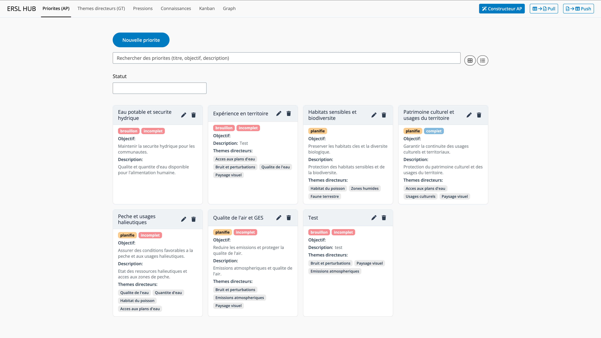</img></center>
</a>

:::

:::
::: {.callout-important icon="false" .fragment} 
### Analytical capabilities

::: {style="font-size: 70%;"}
<a href="https://github.com/inSileco/rcea" target="_blank" rel="noopener noreferrer">
  <center>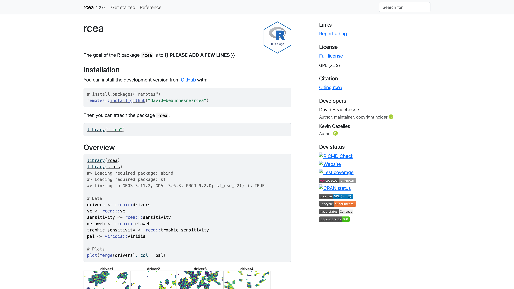</img></center>
</a>

:::

:::
:::
::: {.column}
::: {.callout-tip icon="false" .fragment}
### Decision-support tools

::: {style="font-size: 70%;"}
<a href="https://019cd4a4-de96-879e-dccf-534a7bdd2a23.share.connect.posit.cloud/?private_link_token=9Ri4yjiCBEKhIRtkPqoW3SVbkKZoX8t997EvMkV0u6k0eYhPEuWle3Vlm8viLdnr" target="_blank" rel="noopener noreferrer">
<center>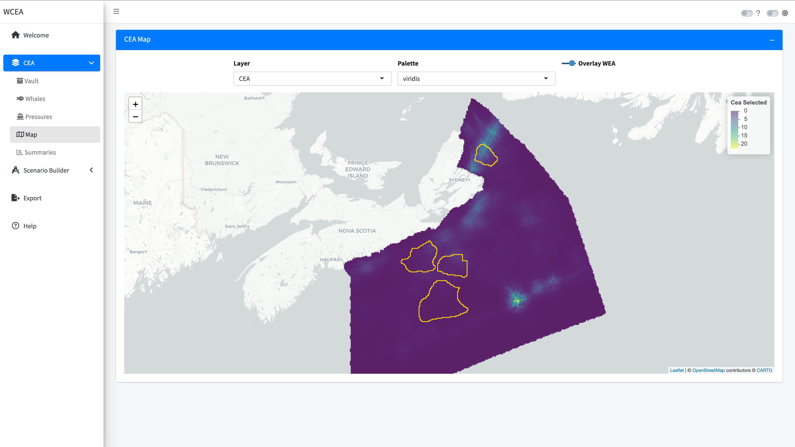</img></center>
</a>

:::
:::
::: {.callout-warning icon="false" .fragment}
### Automated workflows

::: {style="font-size: 70%;"}
<a href="img/workflow3.png" target="_blank" rel="noopener noreferrer">
<center>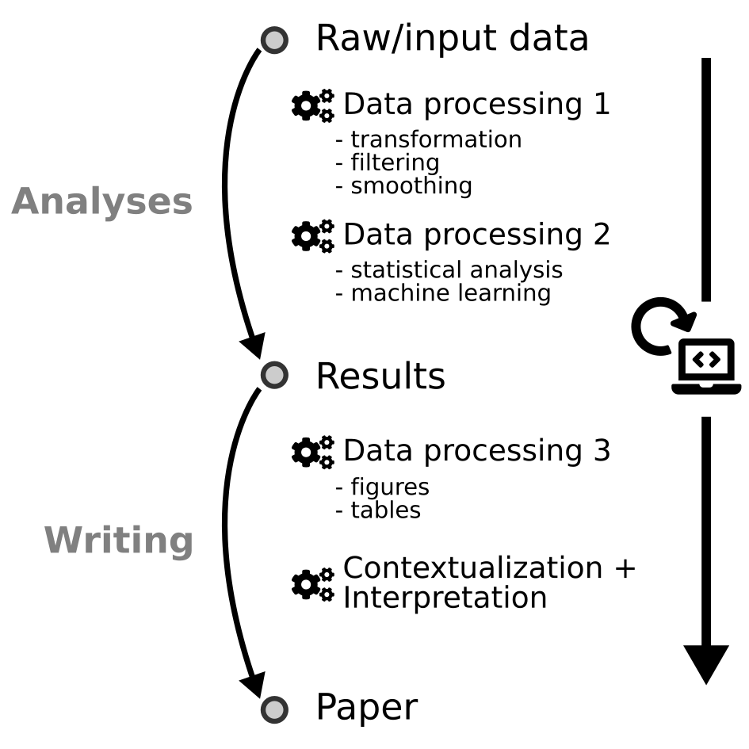</img></center>
</a>

:::
:::

:::
:::
<!-- end columns -->


## Why does this matter? {.transition-slide .center}

### *Shared regional memory*

### *Updatable context* {.fragment}

### *Reuse across assessments* {.fragment}

### *Operational capacity* {.fragment}


## In a nutshell {.transition-slide .center}

***Leverages the assessments***

***to build capacity beyond simple reporting***

# Perspectives

## funnel2 {#funnel_eco2 .full-image-slide data-background-image="img/funnel_eco.png" data-background-size="contain" data-background-position="center center" data-background-color="white"}


## Project-scale CEA {.transition-slide .center}

### *Apply regional context to freshwater projects*

### *Assess incremental risk much faster*

### *Support defensible scoping, mitigation, and follow-up*


## Project builder {#project_builder .full-image-slide data-background-image="img/project_builder.png" data-background-size="contain" data-background-position="center center" data-background-color="white"}

## AI-Assisted workflows

::: {style="font-size: 85%;"}
*AI as a co-pilot for cumulative effects work*
:::

::: {.columns}
::: {.column}
::: {.callout-note icon="false"} 
### Define scope

::: {style="font-size: 70%;"}
- Draft valued components, stressors, pathways, and indicators
- Surface assumptions, missing information, and key questions


:::

:::
::: {.callout-important icon="false" .fragment} 
### Gather evidence

::: {style="font-size: 70%;"}
- Find relevant reports, datasets, and monitoring sources
- Extract structured content into reusable assessment templates


:::

:::
:::
::: {.column}
::: {.callout-tip icon="false" .fragment}
### Explore outputs

::: {style="font-size: 70%;"}
- Query maps, scenarios, and species risks in plain language
- Generate draft summaries to support discussion and reporting


:::
:::
::: {.callout-warning icon="false" .fragment}
### Guardrails

::: {style="font-size: 70%;"}
- Human reviewed
- Source linked
- Versioned and auditable
- Used to support, not replace, expert judgment

:::
:::

:::
:::
<!-- end columns -->

# *inSileco*

## 

:::: {.columns}


::: {.column width="70%"}
### *inSileco*

*Mission*

::: {style="font-size: 70%;"}  
Operationalize environmental management by building the capacity, tools, and systems that environmental professionals and organizations need to work confidently and efficiently.
:::


:::{.fragment}
---

*Collaborations*

::: {style="font-size: 60%;"}  
*Academia (CEM, UofG, UL, ArcticNet, UQAR, UQAT)* 

*Federal (ECCC, AEIC, DFO, CWS)* 

*Provincial (MNR, Nanutsiavut Gvt, MFFP)*

*First Nations (W8banaki, Wendake)*

:::

:::

:::


::: {.column width="30%"}
::: {style="display:flex; flex-direction:column; align-items:center; gap:0px; min-height:520px;"}
<div class="team-card">
  <a href="https://insileco.io/" target="_blank" class="team-photo-link">
    
  </a>

  <a href="https://insileco.io/" target="_blank" class="team-photo-link">
    
  </a>
</div>

<a href="https://insileco.io/" target="_blank" style="display:block; text-align:center; width:100%;">
  
</a>


<div class="team-card">
  <a href="https://insileco.io/" target="_blank" class="team-photo-link">
    
  </a>
  <a href="https://insileco.io/" target="_blank" class="team-photo-link">
    
  </a>
</div>

:::
:::

:::: 

##

### *inSileco*

::: {.columns}
::: {.column}
::: {.callout-note .fixed-height icon="false"}
### Data Management
::: {style="font-size: 90%;"}
::: {.fragment}
- Setup interoperable metadata tools
- Structure data for easy reuse
- Turn one-off studies into living regional context
:::
:::
:::

::: {.callout-important .fixed-height icon="false" .fragment}
### Advanced analytics
::: {style="font-size: 90%;"}
::: {.fragment}
- Build analytical capacity for cumulative effects & scenario analyses
- Connect scoping, modelling, and reporting in one system
:::
:::
:::

:::
::: {.column}

::: {.callout-tip .fixed-height icon="false" .fragment}
### Decision-support tools
::: {style="font-size: 90%;"}
::: {.fragment}
- Explore risks, pathways, and management options
- Assess project contribution to risk
- Custom report generation
:::
:::
:::

::: {.callout-warning .fixed-height icon="false" .fragment}
### Automated workflows
::: {style="font-size: 90%;"}
::: {.fragment}
- Update data, rerun analyses, and support reporting at lower cost
- Add AI where it reduces friction without weakening defensibility
:::
:::
:::

:::
:::
<!-- end columns -->

##

### *inSileco*

::: {.columns}
::: {.column}
::: {.callout-note .fixed-height icon="false"}
### Blog &nbsp; <a href="https://insileco.io/en/blog" target="_blank"><i class="fa-solid fa-globe"></i></a> <a href="https://www.linkedin.com/company/insileco/" target="_blank"><i class="fa-brands fa-linkedin"></i></a>
::: {style="font-size: 90%;"}
***Insights & practcal guidance***

Free content on environmental data, modeling, and decision-making
:::
:::

::: {.callout-important .fixed-height icon="false"}
### Academy 
::: {style="font-size: 90%;"}
***Training & capacity building***

Courses, workshops, and coaching to help teams develop internal capacity
:::
:::

:::
::: {.column}

::: {.callout-tip .fixed-height icon="false"}
### Systems  &nbsp; <a href="https://insileco.io/en/portfolio" target="_blank"><i class="fa-solid fa-globe"></i></a>
::: {style="font-size: 90%;"}
***Custom tools & data systems***

Decision-ready pipelines, models, and applications tailored to your needs
:::
:::

::: {.callout-warning .fixed-height icon="false"}
### Intelligence
::: {style="font-size: 90%;"}
***Environmental assessments***

Complete biodiversity, cumulative effects, and risk assessments
:::
:::

:::
:::
<!-- end columns -->


# 

::: {style="font-size: 110%;"}

::: {.takeaway}
***A well-structured assessment is not just an answer***
:::

::: {.takeaway .fragment}
***It is an operational system for managing risk over time***
:::

:::


# 

::: {style="font-size: 150%;"}
***Thank you!***
:::

<br>

<center></img></center>


